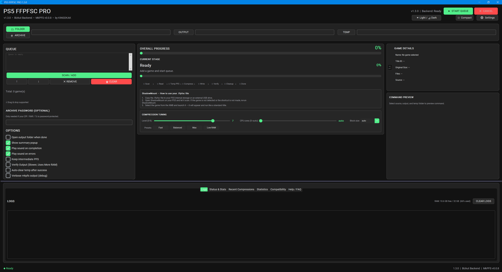
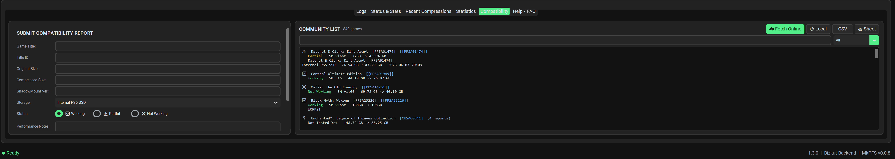
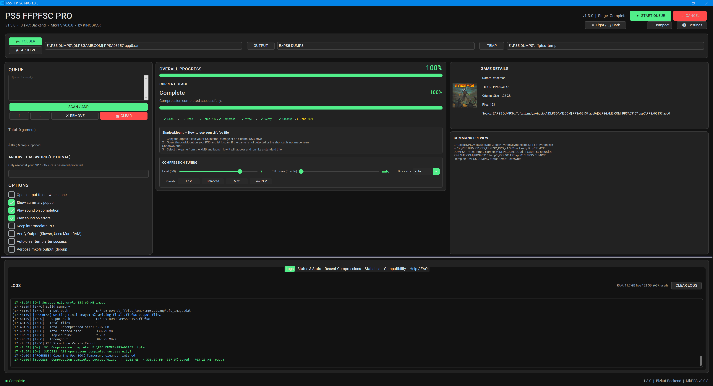

# PS5 FFPFSC PRO

PS5 FFPFSC PRO is a Windows GUI for compressing PlayStation 5 game dumps using MkPFS and FFPFSC.

The goal is simple: make PS5 game compression easier without needing command-line tools or complicated setup.

---

<h1 align="center">🚀 PS5 FFPFSC PRO</h1>

  PS5 Game Compression Utility

  
  
  

  <a href="https://github.com/KINGDKAK/PS5-FFPFSC-PRO/releases">📥 Download</a> •
  <a href="https://youtube.com/@KINGDKAK">📺 YouTube</a> •
  <a href="https://ko-fi.com/KINGDKAK">☕ Ko-fi</a>

---

## 📦 About

PS5 FFPFSC PRO is a Windows GUI for compressing PlayStation 5 game dumps using MkPFS and FFPFSC.

The goal is simple: make PS5 game compression easy without requiring command-line tools or complicated setup.

Whether you're compressing a single game, batch processing multiple titles, or browsing community compatibility reports, everything can be done from one interface.

---

## 🖼️ Screenshots

### Main Window

### Community Compatibility Database

### Compression Progress

---

## ✨ Features

* Compress PS5 game dumps into `.ffpfsc`
* Supports game folders, `.exfat`, `.ffpkg`, `.zip`, `.rar`, and `.7z`
* Drag-and-drop support
* Batch compression
* Multi-image queueing
* Compression tuning options
* Automatic update checker
* Live RAM meter
* Detailed logs and progress tracking
* Per-game output folders
* Compact mode
* Community Compatibility Database

---

## 📂 Supported Inputs

* PS5 game folders
* `.exfat` images
* `.ffpkg` images
* `.zip` archives
* `.rar` archives
* `.7z` archives

---

## 🌐 Community Compatibility Database

After a successful compression, you can optionally submit your results to the community database.

The database allows users to:

* Share compatibility reports
* Report Working / Partial / Not Working / Not Tested Yet status
* Search by game name
* Search by Title ID
* View report counts
* View ShadowMount version information
* Browse compatibility reports directly from the application

Compatibility status is vote-based so one incorrect report cannot override community results.

View the live compatibility database:

https://docs.google.com/spreadsheets/d/1dgu0p7U2yB_mhcUELz-Wkc7Yhs-avoWLY1Gcm0n5XJw/edit?usp=drive_web&ouid=115958744890792485831

Or access it directly from PS5 FFPFSC PRO.

---

## ⚙️ Compression Tuning

Advanced users can fine-tune compression using:

* Compression level selection
* CPU core selection
* Block size selection

Available block sizes:

* Auto
* Auto-Fit
* 16384
* 32768
* 65536

Smaller block sizes may improve results for games containing large numbers of small files.

---

## 🎮 AMPR / APR Support

PS5 FFPFSC PRO can detect games that require the AMPR emulator.

Features include:

* Automatic PlayGo chunk detection
* Dedicated AMPR folder configuration
* Compatibility reporting support

---

## 🚀 Getting Started

1. Download the latest release.
2. Run `PS5_FFPFSC_PRO.exe`
3. Add a game folder, archive, `.exfat`, or `.ffpkg` image.
4. Select your compression settings.
5. Click **Start**.

The application handles the rest.

---

## 🛠️ Common Issues

### Out of Memory

Try:

* Lowering CPU cores
* Lowering compression level
* Closing other applications

### Disk Full

Ensure sufficient free space exists in both:

* Output folder
* Temporary folder

### Write Errors

Verify that:

* Output locations are valid
* Drives are writable
* Storage devices have enough free space

The application provides detailed error messages and recommended fixes whenever possible.

---

## 🙏 Credits

### Compression Backend

* MkPFS
* FFPFSC
* Bizkut

### Community

Special thanks to everyone testing games, submitting compatibility reports, reporting bugs, and helping improve the project.

---

## 🔗 Links

📺 YouTube
https://youtube.com/@KINGDKAK

☕ Ko-fi
https://ko-fi.com/KINGDKAK

📥 Releases
https://github.com/KINGDKAK/PS5-FFPFSC-PRO/releases

---

## ⚠️ Disclaimer

This project is provided as-is.

Only use content you legally own and follow all applicable laws in your region.

---

⭐ If you find the project useful, consider starring the repository and contributing compatibility reports to help the community.
